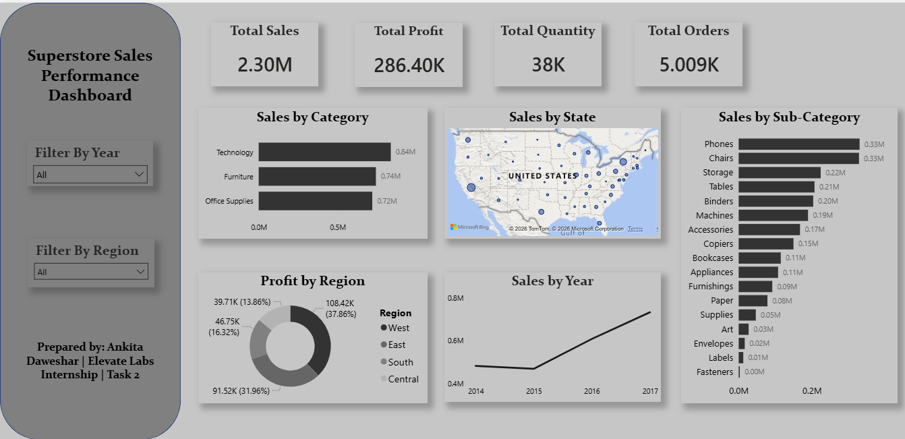

# Task 2: Data Visualization and Storytelling
## Elevate Labs Data Analyst Internship

**Intern:** Ankita Daweshar  
**Date:** 02 June 2026  
**Tool Used:** Power BI Desktop  
**Dataset:** Superstore Sales Dataset (Kaggle)

---

## 📌 Objective
Create meaningful visualizations that convey a compelling business story 
using the Superstore Sales dataset.

---

## 📸 Dashboard Preview

---

## 📂 Dataset Info
- **Source:** Kaggle - Superstore Dataset
- **Records:** 9994 rows × 21 columns
- **Fields Used:** Sales, Profit, Quantity, Region, Category, 
  Sub-Category, Order Date, State

---

## 📊 Dashboard Visuals Created

| # | Visual | Purpose |
|---|--------|---------|
| 1 | KPI Cards | Total Sales, Profit, Quantity, Orders at a glance |
| 2 | Bar Chart | Sales by Category comparison |
| 3 | Bar Chart | Sales by Sub-Category (detailed breakdown) |
| 4 | Line Chart | Sales trend over years |
| 5 | Map Visual | Sales distribution across US States |
| 6 | Donut Chart | Profit share by Region |
| 7 | Slicers | Interactive filters for Year and Region |

---

## 💡 Key Business Insights
- **Technology** is the highest selling category at **$0.84M**
- **West region** contributes the most profit at **37.86%**
- Sales show a **consistent upward trend** from 2014 to 2017
- **Phones and Chairs** are the top selling sub-categories
- **Central region** has the lowest profit share at **13.86%**

---

## 🎨 Design Choices
- Used **Executive theme** for clean professional look
- Consistent color scheme throughout
- Interactive slicers for dynamic filtering
- Minimal clutter — focus on business insights

---

## 📁 Files in this Repository

| File | Description |
|------|-------------|
| `ElevateLabs-Task2.pbix` | Power BI Dashboard file |
| `Superstore_Dashboard.pdf` | Exported dashboard PDF |
| `Sample - Superstore.csv` | Raw dataset |
| `dashboard_screenshot.png` | Dashboard preview image |

---

## 🛠️ Tools Used
- Power BI Desktop
- Power Query Editor (data transformation)
